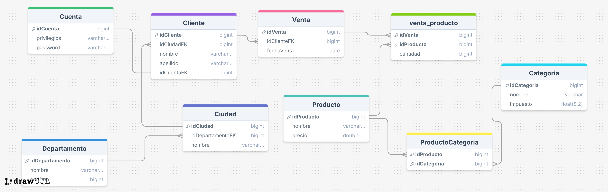

# Conexion a bases de datos relacionales con SpringBoot
## Spring Data JPA
Es un subproyecto de Spring Data, que junto con Spring Jdbc Api y Spring Data JDBC
conforman una serie de subproyectos de spring para la conexion y acceso a bases de datos relacionales.
Spring Data JPA implementa las especificaciones de Jakarta EE para el manejo de bases de datos mediante un ORM.
### Características Principales
- **Mapeo de tablas en entidades de JPA:** Permite seguir un estándar para mapear tablas de base de datos en clases(Entidades) de Java, y sus relaciones como asociaciones entre objetos, la forma de declarar una entidad es la siguiente

  ```java
  import jakarta.persistence.*;
  
  import java.io.Serializable;import java.util.Set;
  
  @Entity
  public class Entidad1 implements Serializable{
      @Id
      private Long id;
      private String atr1;
  }
  @Entity
  public class Entidad2 implements Serializable{
      @Id
      private Long id;
      private String atr1;
  }
  @Entity
  public class Entidad3 implements Serializable{
      @Id
      private Long id;
      private String atr1;
  }
  @Entity
  public class TuEntidad implements Serializable {
    @Id
    @GeneratedValue(strategy = GenerationType.SEQUENCE)//Esta anotación permite especificar la estrategia de generación de claves 
    // primarias al momento de una inserción, GenerationType trae consigo unos enumerados para utilizar
    private Long idEntidad;
    @Column(name = "atributo1", updatable = false)
  //Esta anotación es opcional, aplicar cuando queremos configuraciones específicas
    private String atributo1;
    @OneToOne
    private Entidad1 entidad1;
    
    @OneToMany
    private List<Entidad2> entidades2;
    
    @ManyToMany
    @JoinTable(
        name = "tuEntidad_entidad3",
        joinColumns = @JoinColumn(name = "idTuEntidad"),
        inverseJoinColumns = @JoinColumn(name = "id_entidad3")
    )
    private Set<Entidad3> entidades3;
    /*
     *
     * Declaraciones de atributos, mapea
     * las columnas en atributos y las relaciones en asociaciones entre clases
     *
     */
    
    
  }
  ```
- **Repositorios basados en interfaces:** Permite definir operaciones CRUD mediante interfaces, sin necesidad de implementaciones manuales.
  - La forma de utilizar estas son:
  ```java
  public interface <Entidad>Repository extends VarianteRepository<Entidad,TipoDeIdentificador>{} 
  ```
  - Dentro de las principales variantes de interfaces de Repository, todas con diferentes opciones de operaciones CRUD, se encuentran:
    - CrudRepository<T,ID>
    - ListCrudRepository<T,ID>
    - PagingAndSortingRepository<T,ID>
    - ListPagingAndSortingRepository<T,ID>
    - JpaRepository<T,ID>
- **Consultas derivadas:** Spring JPA tiene la capacidad de generar consultas automáticamente basándose en los nombres 
de los métodos de los repositorios.
  - *Estructura de una consulta derivada:*
  ```java
    <operacionCrud>[Propiedad/es][Condicion/es]([Parámetro/s])
  ```
  - Por ejemplo, para operaciones de lectura, la estructura básica es:
  ```java
    @Repository
    public interface EntidadRepository extends JpaRepository<Entidad,Long>{
        /*Estructura*/
        <retorno> findBy[Propiedad/es][Condicion/es](Params);
        /*Ejemplos*/
        List<Entidad> findByAgeGreaterThan(int age);
        List<Entidad> findDistinctNameByAgeGreaterThan(int age);
  }
  ```
  - Para operaciones de escritura, las consultas derivadas son un poco más restrictivas, y se debe tener cuidado con la creación de estas operaciones, de manera adicional, dichas operaciones deben llevar consigo la
  anotacion @Modifying para indicarle a jpa que se está creando una operación de escritura, y la anotación @Transactional(Del paquete jakarta.*) de forma opcional, para indicarle que ejecute la operación en una unidad
  transaccional y mantener la integridad de los datos.
  ```java
    public interface EntidadRepository extends JpaRepository<Entidad,Long>{
        /*Estructura*/
        <retorno(por lo general son int o bool para dar a conocer si se logró modificar algo)> deleteBy[Propiedad/es][Condicion/es](Params);
        /*Ejemplos*/
        @Modifying
        @Transactional
        boolean deleteByName(String name);
        int deleteById(Long id);
  }
  ```
- **Consultas personalizadas:** Spring JPA tiene soporte para la definición de consultas mendiante JPQL y SQL nativo mediante anotaciones
  - Para crear estas consultas personalizadas, spring brinda una serie de anotaciones con el mismo propósito:
    - _Declaración en los repositorios:_
    ```java
          public interface EntidadRepository extends JpaRepository<Entidad,Long>{
              /*Estructura*/
              @Query(value = "SELECT e FROM Entidad e where e.id=?1 and e.name=?2")//JPQL
              <retorno> nombreConsultaPersonalizada(Param1,Param2);//Es posible referenciar un argumento por posicion en la consulta personalizada 
              /*Ejemplos*/
              @Query(value = "SELECT e FROM Entidad e where e.id=?1 and e.name=?2")
              Optional<Entidad> findByIdAndName(Long id,String name);
              //JPQL también es compatible con el modulo de spring SpEL, pero es necesario utilizar la anotación @Param
              @Query(value = "select c from Cliente c where c.nombre=:#{#nombre} and c.apellido=:apellido ")//Se hace una referencia al campo nombre del objeto Optional del primer parametro,
              //O una referencia directa al nombre del parametro usando entidad.campo=:<parametro>. Ambas maneras son válidas
              Optional<Cliente> findByNombreAndApellido(@Param("nombre") String nombre, @Param("apellido")String apellido);
              //Consultas SQL Nativas:
              @Query(value = "select * from cliente c where c.apellido = ?1 limit 1",nativeQuery = true)
              Optional<Cliente> findFirstByApellido(String apellido);

              @Query(value = "select * from cliente c where c.nombre = :name limit 1",nativeQuery = true)
              Optional<Cliente> findFirstByNombre(@Param("name")String nombre);
          }
    ```
    - _Declaración en las entidades:_ Es posible registrar consultas personalizadas propias de una entidad para luego llamarlas al crear un repositorio:
    ```java
    import jakarta.persistence.NamedNativeQuery;     
    import jakarta.persistence.NamedQuery; 
    @Entity
    @NamedQuery(name = "Entidad.findByAtributo1",query = "SELECT e FROM Entidad e WHERE e.atributo1 = ?1")
    @NamedNativeQuery(name = "Entidad.findByAtributo2",query = "select * from Entidad e where e.atributo2 = ?1")    
    public class Entidad{
        @Id
        private Long id;
        private String atributo1;
        private String atributo2;
    }
    ```
    Luego en el repositorio correspondiente a la entidad:
    ```java
    @Repository
    public interface EntidadRepository extends JpaRepository<Entidad,Long>{
        @Query(name = "findByAtributo1")
        Optional<Entidad> findByAtributo1(String atr1);
    
        @Query(name = "findByAtributo2")
        Optional<Entidad> findByAtributo2(String atr2);
    }
    ```
Siempre es bueno revisar la documentación oficial y otros sitios para encontrar información útil, algunas recomendaciones son:
- Sitio oficial de [Spring Framework][1]
- [Baeldung][2] Es un sitio web especializado de Java, Spring Framework y SpringBoot
  - Más sobre derived Queries : [DerivedQueries][3]
  - Más sobre JPQL: [JPQLReference][4]

_El presente proyecto trae un ejemplo práctico documentado usando Spring Data JPA_
- Modelo relacional usado para la base de datos del proyecto



[1]: https://spring.io/projects/spring-data-jpa
[2]: https://www.baeldung.com/
[3]: https://docs.spring.io/spring-data/jpa/reference/jpa/query-methods.html
[4]: https://danielme.com/2022/01/19/curso-jakarta-ee-jpa-con-hibernate-el-lenguaje-jpql-hql-consultas-basicas-y-modificaciones/
