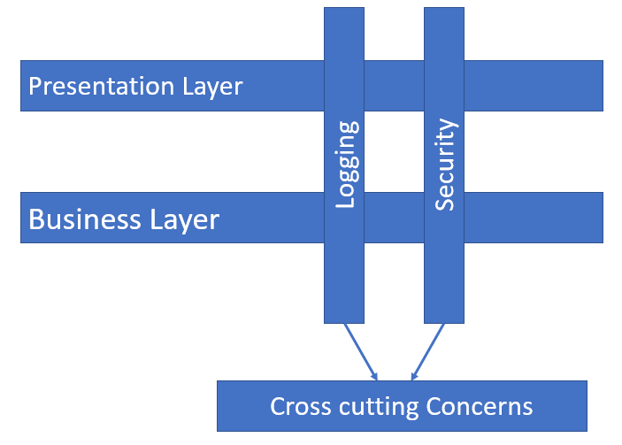
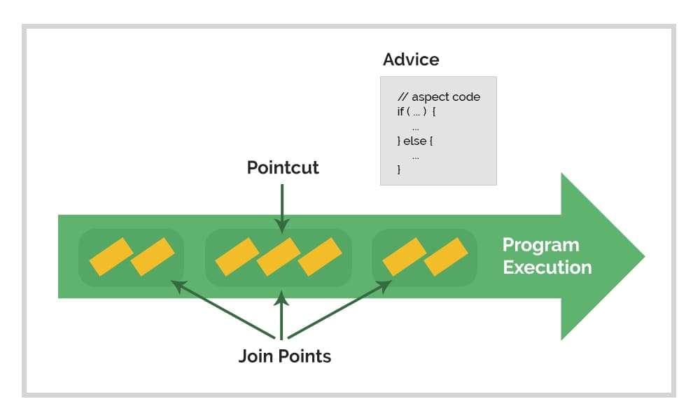
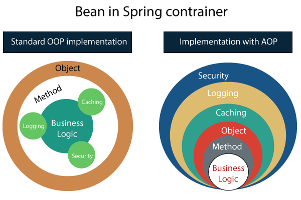

# Programación Orientada a Aspectos (AOP) en Spring

## Introducción

La Programación Orientada a Aspectos (AOP, por sus siglas en inglés) en **Spring Framework** permite la separación de preocupaciones transversales del código principal de una aplicación. 
Los aspectos como el **logging**, la **seguridad** o la **gestión de transacciones** se pueden implementar de forma transversal, mejorando la modularidad de un proyecto.
Es altamente utilizado por otros módulos de spring, y en proyectos grandes donde el desacoplamiento y cohesion de código es fundamental para la escalabilidad y mantenimiento.

---

## Conceptos Clave

### 1. **Aspectos**
Un aspecto es un módulo que encapsula una preocupación transversal. 

Un aspecto se compone de:
- **Puntos de corte (Pointcuts)**: Definen expresiones para identificar donde aplicar el aspecto.
- **Consejos (Advices)**: Acciones que se ejecutan en un punto de inserción. Tipos de *advices*:
    - **Before Advice**: Se ejecuta antes de un método.
    - **After Advice**: Se ejecuta después de un método, sin importar el resultado.
    - **Around Advice**: Se ejecuta antes y después de un método.
    - **After Returning Advice**: Se ejecuta después de que un método retorna exitosamente.
    - **After Throwing Advice**: Se ejecuta solo si un método lanza una excepción.

### 2. **Join Points**
Un *join point* es un punto en la ejecución del programa donde se puede aplicar un aspecto. En Spring AOP, los *join points* más comunes son las invocaciones de métodos.

### 3. **Pointcuts**
Los *pointcuts* son expresiones que definen en qué *join points* se debe aplicar un **advice**. Estos especifican los métodos o clases en los que el aspecto debe actuar.



---

## Weaving (Tejido)

El *weaving* es el proceso de vincular un aspecto con el código de aplicación. Puede ocurrir en tres momentos:
- **Tiempo de compilación**: El aspecto se inserta en el código compilado.
- **Tiempo de carga**: Se insertan los aspectos cuando las clases son cargadas por la JVM.
- **Tiempo de ejecución**: En Spring, la inserción de aspectos generalmente ocurre en tiempo de ejecución mediante proxies dinámicos:`@EnableAspectJAutoProxy`


---

## Configuración en Spring

### **Mediante Anotaciones (@Aspect)**
Se usa la anotación `@Aspect` para definir aspectos. Ejemplo:

```java
//Creacion de un modulo de aspectos
@Component
@Aspect
public class LoggingAspect {
    
    @Before("execution(* com.example.service.*.*(..))")
    public void logBeforeMethod(JoinPoint joinPoint) {
        System.out.println("Before method: " + joinPoint.getSignature().getName());
    }
}
//Habilitar la configuracion de aspectos propios en Spring
@Configuration
@EnableAspectJAutoProxy
public class aspectConfiguration{
}
```

### **Documentacion:**
* [Spring AOP reference](https://docs.spring.io/spring-framework/reference/core/aop.html)
* [Spring AOP explain](https://www.arquitecturajava.com/spring-aop-y-aspectos/)
* [Spring AOP decoupling](https://sacavix.com/2020/02/spring-aop-conceptos-y-ejemplos-en-la-capa-transversal-de-las-arquitecturas/)